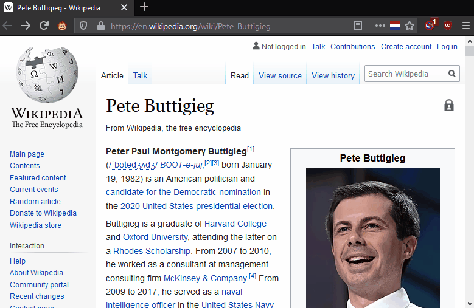

# Wikipedia Speaks
hear how to pronounce wikipedia's IPA glyphs!

converts all IPA links to [itineranium](https://github.com/itinerarium)'s great [pronounciation script](https://itinerarium.github.io/phoneme-synthesis/)

# huh?
check it:

